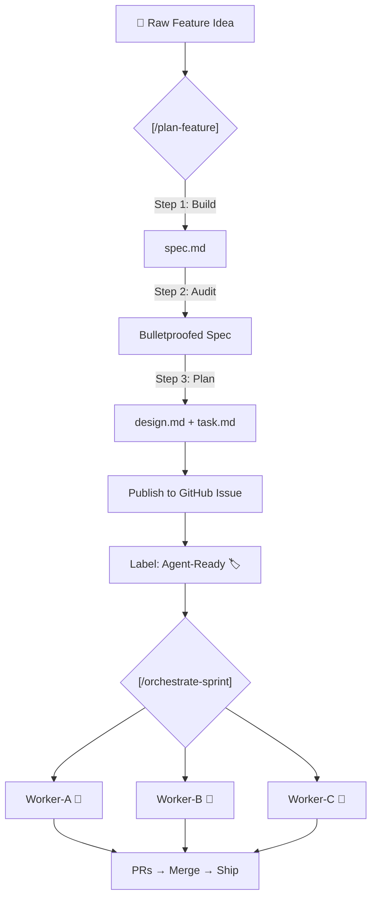
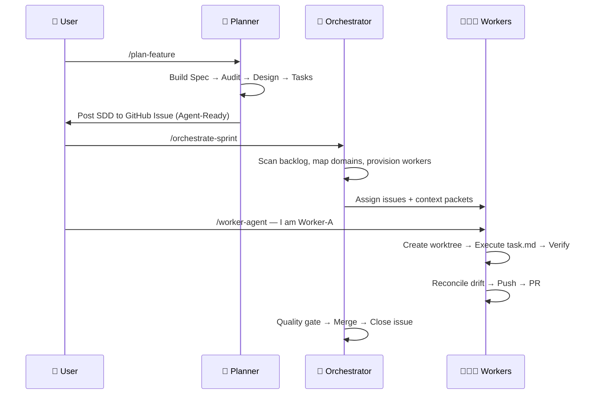

# 🍌 Minions

> **Agent-driven development framework.** A ready-to-clone workspace for running multi-agent sprints with [Antigravity](https://docs.google.com/document/d/1eGKwpmYM8YN2nBkqNHVj5F87GPHUlJ1e1KfN2W7ByBE/edit) powered by Spec-Driven Development (SDD).

Minions gives you the scaffolding to turn a chaotic backlog into an assembly line of autonomous AI worker agents — each operating in an isolated domain with zero merge conflicts.

---

## What's in the Box

```
.agent/
├── rules.md                    # Workspace rules (conventions, design system, domains)
├── templates/
│   ├── spec.md                 # Product specification template
│   ├── design.md               # Technical design template
│   └── task.md                 # Execution task list template
└── workflows/
    ├── plan-feature.md         # 🍌 End-to-end SDD planning (spec → audit → design → tasks)
    ├── worker-agent.md         # 🍌 Sprint worker lifecycle
    ├── orchestrate-sprint.md   # 🍌 Multi-agent sprint orchestration
    ├── context-packet.md       # 🍌 Agent assignment template
    ├── code-review.md          # Code review checklist
    ├── git-commit.md           # Conventional commit generator
    ├── git-pr.md               # Pull request description generator
    ├── refactor.md             # Safe refactoring workflow
    ├── unit-test.md            # Test generation workflow
    └── workflow-creator.md     # Create new workflows
CONTRIBUTING.md                 # How humans and agents collaborate
README.md                       # You are here
```

## The SDD Lifecycle

Every feature goes through four phases before code ships:



1. **Spec & Audit** — Define what success looks like. Audit for contradictions, missing guards, and incomplete journeys.
2. **Plan** — Generate a technical design and atomic task list. No code until approved.
3. **Execute** — Worker agents pick up `Agent-Ready` issues and implement in isolated `git worktree` branches.
4. **Reconcile** — Drift detection ensures code matches the spec. Artifacts are updated before PR.

## Quick Start

### 1. Clone this repo as your project's `.agent/` directory

```bash
# Option A: Clone into an existing project
git clone https://github.com/illya-naumov/minions.git .agent

# Option B: Use as a template for a new repo
gh repo create my-app --template illya-naumov/minions
```

### 2. Customize the workspace rules

Edit `.agent/rules.md` to define your project's:
- Brand & voice guidelines
- Design system tokens (colors, fonts, icons)
- File organization conventions
- Domain labels for multi-agent isolation
- Auto-approved commands

### 3. Configure your Global Rules

Set these in your IDE's global AI assistant settings (e.g., `.gemini/settings.json` or equivalent). These are **project-agnostic philosophy rules** that apply across all your repos:

```markdown
# Project Rules

## Core Philosophy
> **"Readability and Order > Speed and Complex Interconnections"**

Maintainability and clarity over clever, hyper-optimized code.

- **SOLID Principles:** Single Responsibility, Open-Closed, Liskov Substitution,
  Interface Segregation, Dependency Inversion.
- **DRY:** Extract common logic into reusable functions, modules, or hooks.
- **KISS:** Prefer simplicity in design and implementation. Avoid over-engineering.
- **Clean Code:** Meaningful names, small functions, clear structure.

## Spec-Driven Development
- Define what success looks like before writing a single line of code.
- Every feature or fix requires a product specification, a technical design,
  and an execution plan — approved before implementation begins.
- If real-world code drifts from the original design, reconcile the design
  artifacts first, then continue.

## Code Quality
- Explicit over implicit. No "magic" one-liners.
- Components must be small, focused, and have a clear purpose.
- Comments explain *why*, not *what*. English only.
- Error handling must use structured logging:
  `logger.info({id, foo}, 'Message')`.

## Styling
- Vanilla CSS with CSS Variables. No Tailwind unless explicitly requested.
- No inline styles except for dynamic values.
- Defer to workspace rules for design system specifics.

## Workflows
- Always verify changes locally before requesting review.
- Follow the defined workflows in `.agent/workflows/`.
```

### 4. Start planning features

```
/plan-feature — I want to add user authentication with OAuth2
```

### 5. Run a sprint

```
/orchestrate-sprint
```

## Core Workflows

| Workflow | Slash Command | Purpose |
|----------|---------------|---------|
| **Plan Feature** | `/plan-feature` | Full SDD pipeline: spec → audit → design → tasks → stage issue |
| **Worker Agent** | `/worker-agent` | Bootstrap a sprint worker to execute assigned issues |
| **Orchestrate Sprint** | `/orchestrate-sprint` | Provision workers, assign issues, monitor progress, merge PRs |
| **Context Packet** | `/context-packet` | Template for agent assignment with scope/deps/contracts |
| **Code Review** | `/code-review` | Structured review for quality, security, maintainability |
| **Git Commit** | `/git-commit` | Generate conventional commit messages from staged changes |
| **Git PR** | `/git-pr` | Generate comprehensive PR descriptions |
| **Refactor** | `/refactor` | Safe refactoring with verification |
| **Unit Test** | `/unit-test` | Generate tests adapting to your framework |
| **Workflow Creator** | `/workflow-creator` | Create new workflows following the stack-agnostic pattern |

## How Multi-Agent Sprints Work



**Key principle:** No two workers ever touch the same domain at the same time. Conflicts are structurally impossible.

## Customization Guide

### Adding Domain Labels

Define your project's domains in `.agent/rules.md`:

```markdown
## Multi-Agent Protocol
- **domain:frontend** → `src/components/`, `src/pages/`
- **domain:backend** → `api/`, `services/`
- **domain:infra** → `.github/`, `terraform/`, `docker/`
```

### Adding Skills

Drop skill folders into `.agent/skills/`. Each skill needs a `SKILL.md` with YAML frontmatter:

```markdown
---
name: my-skill
description: What this skill enables
---
# Skill instructions here
```

Browse community skills at [VoltAgent/awesome-agent-skills](https://github.com/VoltAgent/awesome-agent-skills).

## Philosophy

This framework is built on a simple belief: **AI agents are only as good as the specifications they're given.** 

Without structure, agents hallucinate architecture, skip edge cases, and create merge nightmares. With SDD, they become reliable software engineers that follow a defined contract.

Minions enforces the human-in-the-loop at the right moment — *before* code is written — so that execution is fast, correct, and conflict-free.

## License

MIT — use it, fork it, make it yours. 🍌
